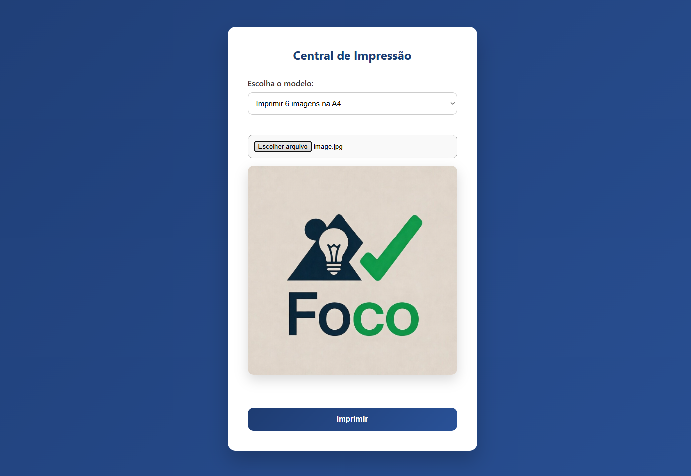
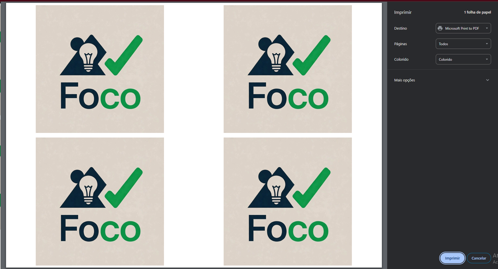
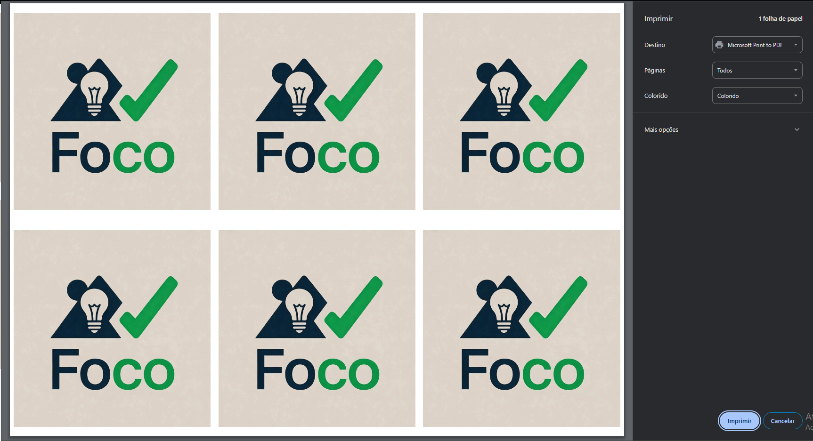

# Central de Impressão

Aplicação web simples (HTML, CSS e JavaScript) para **montar e imprimir**:
- **4 imagens em A4 (paisagem)**
- **6 imagens em A4 (paisagem)**
- **Imagem única em A4 / A3**
- **Avisos em texto (A4 / A3)**

A imagem e o texto são enviados entre páginas via **localStorage**, e cada modelo possui seu template em `/pages`.

---

## Página web
https://gabrieldittrich.github.io/central-de-impressao/
---

## 📁 Estrutura do projeto

<pre>
FORMATO_DE_IMPRESSAO/
├─ index.html
├─ img/
├─ js/
│ ├─ index.js
│ └─ pages/
├─ pages/
│ ├─ 4x_img_A4.html
│ ├─ 6x_img_A4.html
│ ├─ imagem_A4.html
│ ├─ imagem_A3.html
│ ├─ aviso_A4.html
│ └─ aviso_A3.html
└─ style/
├─ index.css
└─ pages/
</pre>

---

## Prints

### Tela inicial

  

### Modelo 4x A4

  

### Modelo 6x A4

  

---

## ✅ Como rodar

### Opção 1 (recomendada): Live Server (VS Code)
1. Abra a pasta no VS Code  
2. Instale a extensão **Live Server**  
3. Clique com o botão direito no `index.html` → **Open with Live Server**

> Isso evita problemas com `localStorage` quando abrindo direto com `file://`.

### Opção 2: abrir direto no navegador
Você pode abrir o `index.html`, mas alguns navegadores podem ter comportamento inconsistente com `localStorage` dependendo do caminho.

---

## 🖨️ Como usar

1. Selecione o **modelo** no seletor
2. Para modelos de **imagem**, escolha um arquivo no input
3. Para modelos de **aviso**, digite o texto no campo
4. Clique em **Imprimir**
5. O template abre em nova aba e dispara a impressão

---

## 🧠 Como funciona por baixo

- A imagem selecionada é convertida para **base64** e salva em:
  - `localStorage["imagemSelecionada"]`
- O texto do aviso é salvo em:
  - `localStorage["textoAviso"]`
- Cada página de modelo (`/pages`) lê o `localStorage`, monta o layout (grid) e chama `window.print()`.

---

## 🔧 Tecnologias
- HTML5
- CSS3 (grid e @page para impressão)
- JavaScript (DOM, FileReader, localStorage)

---

## 🚀 Próximas melhorias (ideias)
- Margem configurável
- Opção de “preencher” (`object-fit: cover`) vs “conter” (`contain`)
- Ajuste de espaçamento (padding) no layout
- Botão “limpar seleção” / “limpar aviso”
- Suporte a múltiplas imagens (em vez de repetir a mesma)

---

## 📜 Licença
Sinta-se livre para usar e modificar. (Se quiser, coloque MIT)
