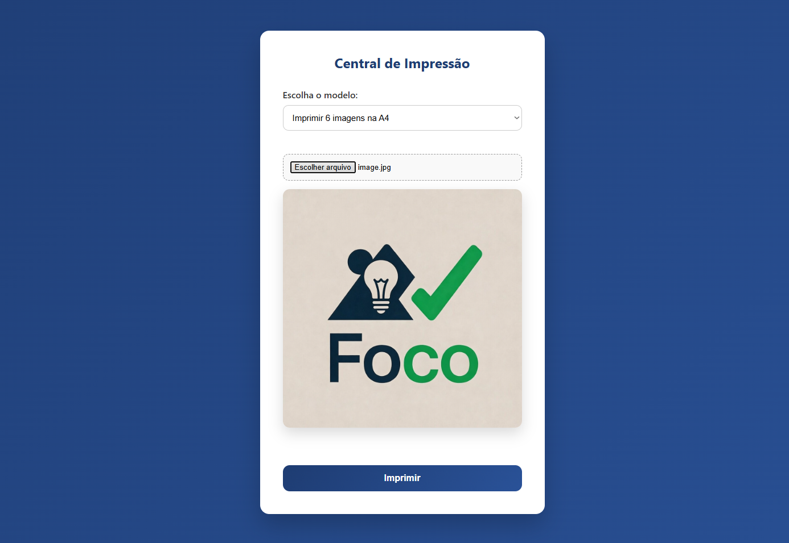
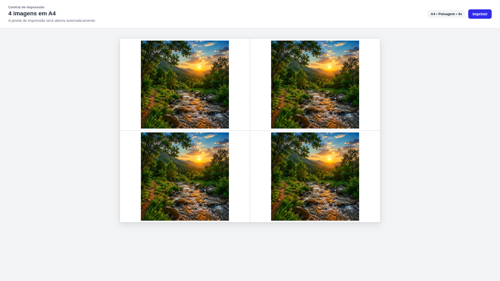
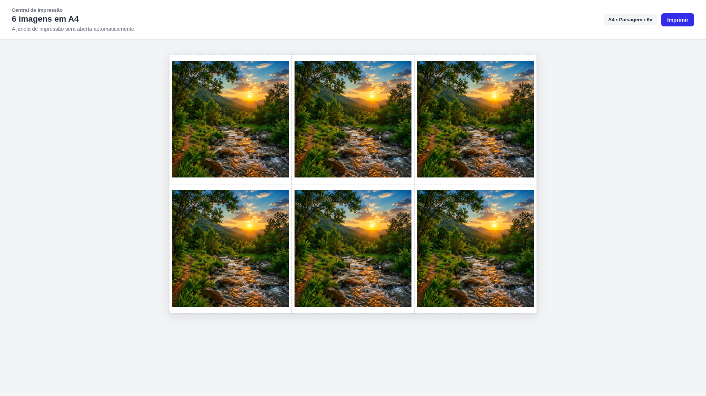

# Central de Impressão

Aplicação em HTML, CSS e JavaScript para preparar, pré-visualizar, imprimir e exportar modelos de impressão. Funciona no navegador, sem backend.

## Modelos

- Uma mesma imagem repetida **4, 6 ou 8 vezes** em A4 paisagem.
- Imagem única em **A4 ou A3** paisagem.
- Aviso em texto em **A4 ou A3** paisagem.
- **QR Code** de um link `http://` ou `https://`.
- **Código de barras Code 128** para um identificador ou link curto.

[Ver a página publicada](https://gabrieldittrich.github.io/central-de-impressao/)

## Como usar

1. Abra o `index.html` com o Live Server no VS Code.
2. Escolha um modelo. Selecione uma imagem, digite um aviso ou informe o link/código, conforme o modelo.
3. Clique em **Pré-visualizar** para abrir a folha sem o diálogo de impressão, ou em **Imprimir** para abrir o Ctrl+P automaticamente após o conteúdo carregar.
4. Na página da folha, use **Imprimir esta folha** ou **Imprimir novamente**. Nos modelos de QR Code e Code 128, também é possível **Baixar SVG**.

O diálogo nativo do Ctrl+P pode bloquear a interação com outras abas. Para preparar vários modelos antes de imprimir, abra cada um e deixe no **Pré-visualizar**.

> Recomenda-se o Live Server porque o comportamento de `localStorage` em páginas abertas diretamente por `file://` varia entre navegadores.

## Estrutura do projeto

```text
central-de-impressao/
├── index.html
├── README.md
├── assets/                 # ícone e capturas de tela
├── pages/                  # páginas das folhas
│   ├── 4x_img_A4.html
│   ├── 6x_img_A4.html
│   ├── 8x_img_A4.html
│   ├── imagem_A4.html
│   ├── imagem_A3.html
│   ├── aviso_A4.html
│   ├── aviso_A3.html
│   ├── codigo_qr.html
│   └── codigo_barras.html
├── js/
│   ├── index.js            # seleção, validação e abertura dos modelos
│   ├── pages/              # geração do conteúdo e impressão
│   └── vendor/             # bibliotecas locais de QR e Code 128
│       ├── qrcode-generator.js
│       ├── qrcode-utf8.js
│       └── JsBarcode.all.min.js
├── style/
│   ├── index.css
│   └── pages/              # prévia na tela e regras @media print
└── licenses/
    ├── qrcode-generator-MIT.txt
    ├── JsBarcode-MIT.txt
    └── THIRD_PARTY.md
```

## Como funciona

O `js/index.js` usa `FileReader` para converter a imagem selecionada em uma URL de dados e guarda o conteúdo no `localStorage`:

| Chave               | Conteúdo                                         |
| ------------------- | ------------------------------------------------ |
| `imagemSelecionada` | Imagem para os modelos 4x, 6x, 8x e imagem única |
| `textoAviso`        | Texto dos avisos A4/A3                           |
| `codigoConteudo`    | Link do QR Code ou texto do Code 128             |

Cada página em `pages/` lê a chave correspondente e monta a folha. As regras `@media screen` apresentam a prévia; `@media print` deixa apenas o conteúdo da folha e define o papel com `@page`. Nos modelos com várias imagens, as linhas tracejadas aparecem apenas na tela.

O QR Code usa `qrcode-generator` com margem branca de quatro módulos. O código de barras usa `JsBarcode` no formato Code 128. As duas bibliotecas estão em `js/vendor/`, então não há dependência de CDN durante o uso. O botão **Baixar SVG** exporta um desenho vetorial, que não fica pixelado ao ampliar.

**Limites:** o QR requer um link completo. O Code 128 aceita até 60 caracteres ASCII imprimíveis; links longos devem usar QR Code. Um SVG continua nítido ao ser reduzido, mas a leitura por câmera ou leitor depende do tamanho físico e da qualidade da impressão.

## Capturas de tela

As capturas abaixo são da versão inicial do projeto; a interface atual inclui os modelos e a pré-visualização descritos acima.

| Tela inicial                                               | Modelo 4x                          | Modelo 6x                          |
| ---------------------------------------------------------- | ---------------------------------- | ---------------------------------- |
|  |  |  |

## Tecnologias e licenças

- HTML5, CSS3 e JavaScript no navegador.
- Bibliotecas de terceiros com licença MIT e seus avisos em [`licenses/THIRD_PARTY.md`](licenses/THIRD_PARTY.md).
- O projeto Central de Impressão ainda não possui um arquivo de licença próprio. As licenças em `licenses/` aplicam-se às bibliotecas indicadas.
